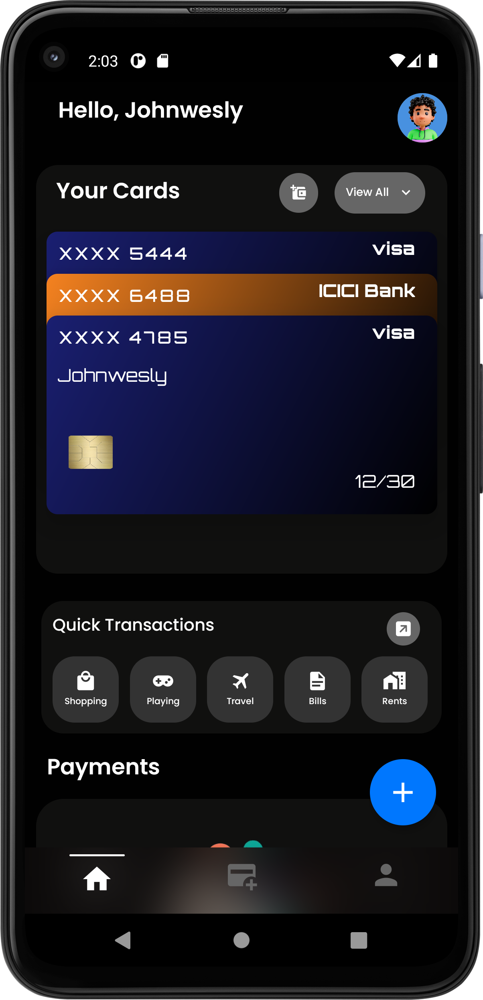
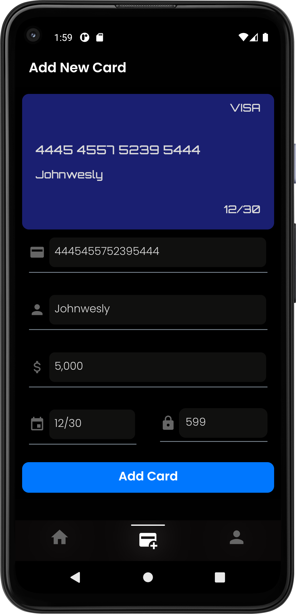
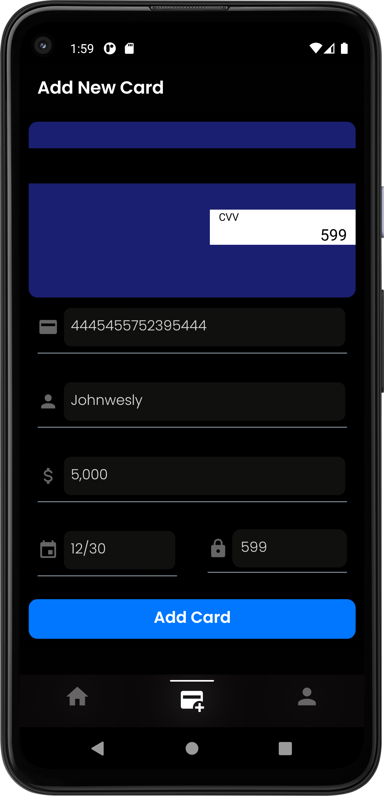
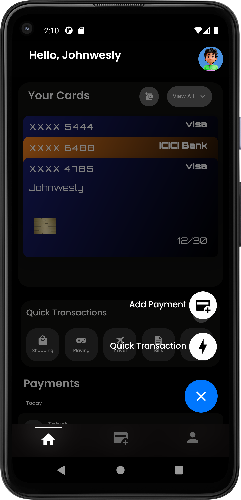
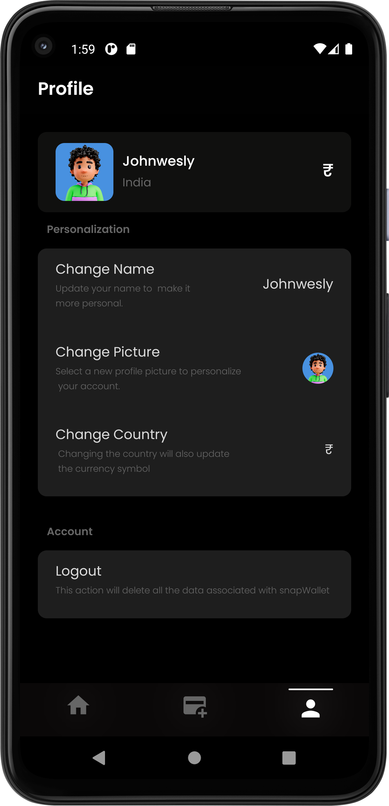
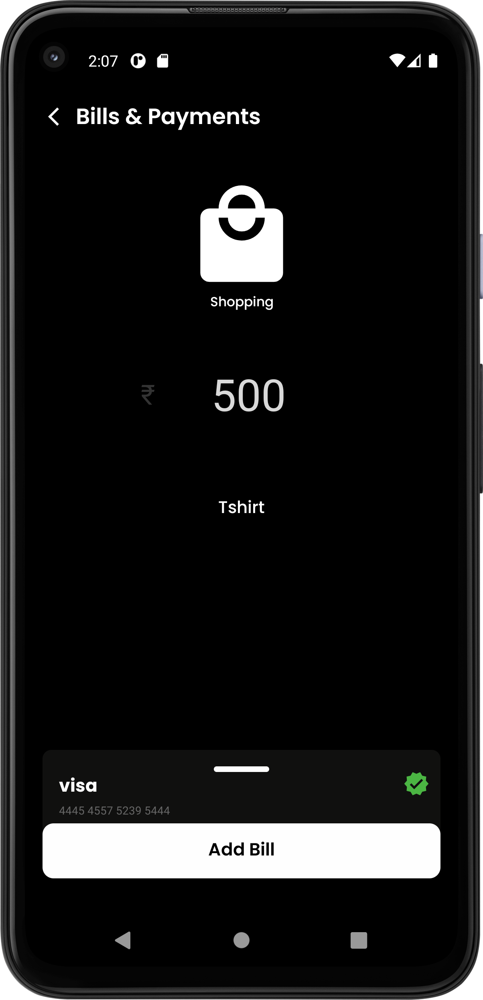
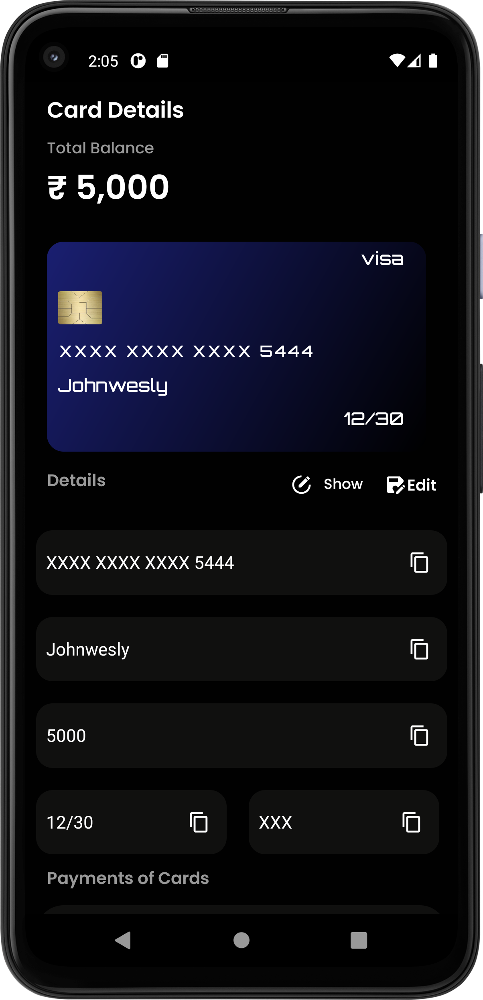
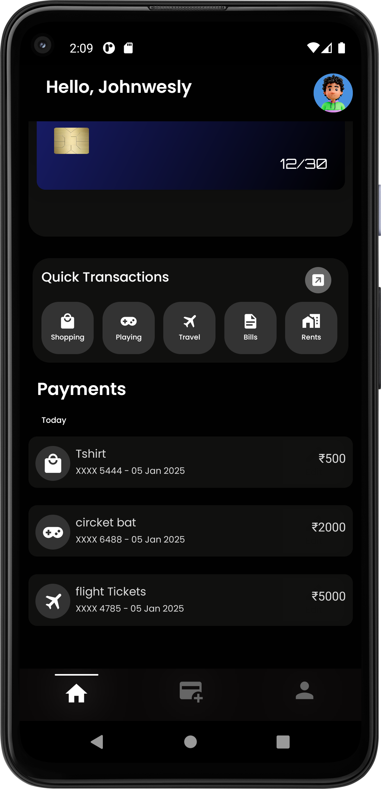
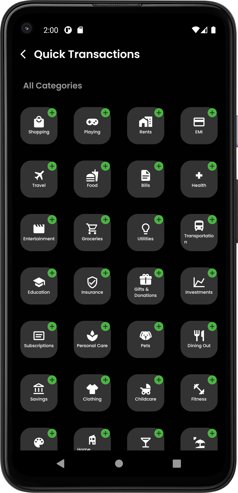

<div style="text-align: center;">
  
  <h1>SnapWallet</h1>
  <h4>SnapWallet is a React Native Application, Built for managing and maintaining  the money and credit cards in simple and easy way for daily transactions and history tracking, balance updates.</h4>
</div>

# ScreenShots
<div style="display: flex, flex-direction: row; justify-content:center,align-Items:center">










</div>


# Features
### 1.User Registration

- **Easy Registration** User can create a account by selecting the username,profilepicture and country.

### 2.Credit Card Management


 **Add Credit Cards** 
- Enter credit card details  including card number, expiry date, CVV, and name.
- Automatically detect the bank based on the credit card number.

**Card Details Display** 
- View added credit card details in an organized manner
- Easily copy the card number, expiry date, CVV, and name to the clipboard

### 3.Payments and Transactions
 **Add Payments**
 - Record payments made using any of the stored credit cards.
 - Include details like the amount, date, and category of the transaction

**Organize Bills**
 - Categorize transactions to keep track of expenses
 - View and edit previously added payments for accurate record-keeping
### 4.Profile Page
 - **Customization** Personalize the user details by modifying profile picture,country and username.
 - Convenient options to edit, delete, and manage user data
### 5.Data Security
- **Secure Credit Cards** handling of sensitive credit card information
- Local data storage to ensure user privacy and security.
-**Easy-to-use** options for clearing data associated with **snapWallet** when logging out.

# Folder Structure
The Project's Folder Structure is following: 

- `src/` - contains source code for SnapWallet Application.
   - `components/` - Contains reusable UI components like buttons, modals, or card views.
   - `constants/` - Stores constants like color palettes and fixed data for easy configuration.
   - `navigation/` -  Includes files for setting up stack and tab navigation for seamless routing between screens.
   - `redux/` - Redux store configuration and slices for state management.
   - `schemas/` - React Realm schemas for managing local database structures such as users, transactions, and categories.
   - `screens/` - Each screen has its own folder containing: 

       - `fileName.tsx` - The visual layout of the screen. 

       - `usefileName.ts` - Encapsulated business logic and reusable hooks for the screen.

       - `fileNamestyles.ts`- Screen-specific styles.
   - `services/` -  Handles application logic, including credit card management, user updates, transactions, and Realm database operations.
   - `utils/` - Utility functions for common tasks like formatting and validations.
- `assets/` - Stores fonts and images used in the application

- `android/` - Platform-specific configurations and assets
- `ios/` - Platform-specific configurations and assets

# How to Install and run locally ?
 **Follow these steps to run the SnapWallet Application locally:**
  - 1.Download and install Node.js from the official website: [Node.js Download](https://nodejs.org/en/download)

  - 2.Create a Folder and Open the cmd terminal on your machine.
  - 3.Run this command:
   ```shell
   git clone https://github.com/johnwesly2002/SnapWallet.git
   ```

  - 4.Wait for Git to Clone the repository to your Machine.

  - 5.Once the cloning process is complete, navigate to the project's root directory:

   ```shell
    cd SnapWallet
   ```
  - 6.Run the command to install all required dependencies:
   ```shell
   npm install
   ```
  - 7.Make sure you have a simulator or a device set up for running the app
  

Let Metro Bundler run in its _own_ terminal. Open a _new_ terminal from the _root_ of your React Native project. Run the following command to start your _Android_ or _iOS_ app:

### For Android

```bash
# using npm
npm run android

# OR using Yarn
yarn android
```

### For iOS

```bash
# using npm
npm run ios

# OR using Yarn
yarn ios
```

If everything is set up _correctly_, you should see your new app running in your _Android Emulator_ or _iOS Simulator_ shortly provided you have set up your emulator/simulator correctly.

This is one way to run SnapWallet — you can also run it directly from within Android Studio and Xcode respectively.

## Congratulations! :tada:

You've successfully run SnapWallet App. :partying_face:
